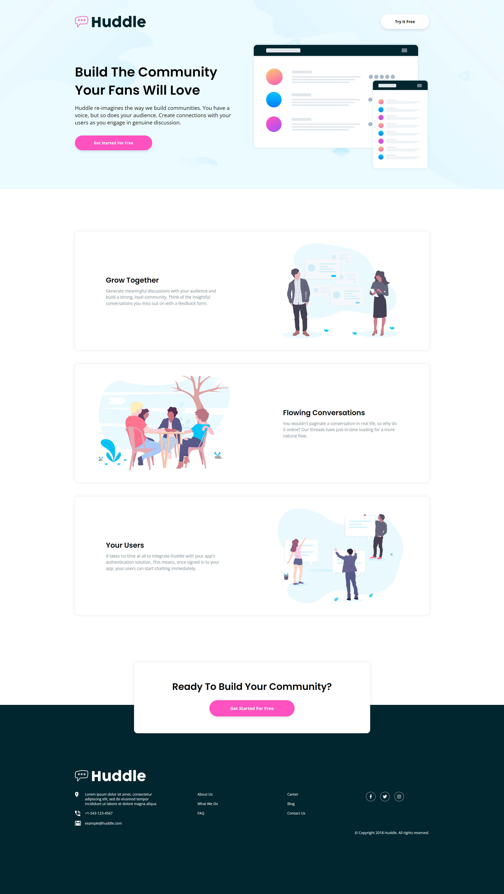

# Frontend Mentor - Huddle landing page with alternating feature blocks solution

This is a solution to the [Huddle landing page with alternating feature blocks challenge on Frontend Mentor](https://www.frontendmentor.io/challenges/huddle-landing-page-with-alternating-feature-blocks-5ca5f5981e82137ec91a5100). Frontend Mentor challenges help you improve your coding skills by building realistic projects.

## Table of contents

- [Overview](#overview)
  - [The challenge](#the-challenge)
  - [Screenshot](#screenshot)
  - [Links](#links)
- [My process](#my-process)
  - [Built with](#built-with)
  - [What I learned](#what-i-learned)
- [Author](#author)

## Overview

### The challenge

Users should be able to:

- View the optimal layout for the site depending on their device's screen size
- See hover states for all interactive elements on the page

### Screenshot



### Links

- Solution URL: [https://github.com/KH-Ray/huddle-landing-page-with-alternating-feature-blocks](https://github.com/KH-Ray/huddle-landing-page-with-alternating-feature-blocks)
- Live Site URL: [https://kh-ray.github.io/huddle-landing-page-with-alternating-feature-blocks/](https://kh-ray.github.io/huddle-landing-page-with-alternating-feature-blocks/)

## My process

### Built with

- Semantic HTML5 markup
- Flexbox
- CSS Grid

### What I learned

Use this section to recap over some of your major learnings while working through this project. Writing these out and providing code samples of areas you want to highlight is a great way to reinforce your own knowledge.

To see how you can add code snippets, see below:

```html
<main class="main container margin-bottom-16">
  <div class="grid grid--2-cols">
    <div class="text-main">
      <h2 class="heading-secondary heading">Grow Together</h2>
      <p class="paragraph-main">
        Generate meaningful discussions with your audience and build a strong,
        loyal community. Think of the insightful conversations you miss out on
        with a feedback form.
      </p>
    </div>

    
  </div>
  <div class="grid grid--2-cols">
    

    <div class="text-main">
      <h2 class="heading-secondary heading">Flowing Conversations</h2>
      <p class="paragraph-main">
        You wouldn't paginate a conversation in real life, so why do it online?
        Our threads have just-in-time loading for a more natural flow.
      </p>
    </div>
  </div>
  <div class="grid grid--2-cols">
    <div class="text-main">
      <h2 class="heading-secondary heading">Your Users</h2>
      <p class="paragraph-main">
        It takes no time at all to integrate Huddle with your app's
        authentication solution. This means, once signed in to your app, your
        users can start chatting immediately.
      </p>
    </div>

    
  </div>
</main>
```

```css
@media only screen and (max-width: 600px) {
  html {
    font-size: 50%;
  }

  .container {
    width: 95%;
  }

  .btn--general {
    transform: scale(0.85);
  }

  /* HEADER SECTION */
  .header .grid {
    width: 85%;
    margin: 9.6rem auto 0;
    text-align: center;

    grid-template-columns: 1fr;
    justify-items: center;
    align-items: center;
  }

  .heading-primary {
    font-size: 2.8rem;
  }

  .text-header {
    margin-bottom: 6.4rem;
  }

  .huddle-logo-header {
    width: 50%;
  }

  .bg-hero {
    height: 96rem;
  }

  /* MAIN SECTION */
  .main .grid {
    grid-template-columns: 1fr;
    grid-template-rows: 1fr;
    gap: 6.4rem;

    height: 100%;
    padding: 3.2rem;
    text-align: center;
  }

  .text-main {
    width: 85%;
  }

  .img-main {
    height: 22rem;
    grid-row: 1;
  }

  /* CTA SECTION */
  .paragraph-cta {
    text-align: center;
    font-size: 2rem;
  }

  /* FOOTER SECTION */
  .footer .grid {
    grid-template-columns: 1fr;
    justify-items: start;
    gap: 1.6rem;
  }

  .footer .container {
    padding-top: 14rem;
  }

  .huddle-logo-footer {
    height: 50%;
  }

  .information {
    margin-top: 1.6rem;
  }

  .logos {
    justify-self: center;
  }

  .copyright {
    margin-top: 2.4rem;
    justify-content: center;
  }
}
```

## Author

- Frontend Mentor - [@UncertainlySure](https://www.frontendmentor.io/profile/UncertainlySure)
